<!-- Copy and paste the converted output. -->

<!-----
NEW: Check the "Suppress top comment" option to remove this info from the output.

Conversion time: 15.699 seconds.

Using this Markdown file:

1. Paste this output into your source file.
2. See the notes and action items below regarding this conversion run.
3. Check the rendered output (headings, lists, code blocks, tables) for proper
   formatting and use a linkchecker before you publish this page.

Conversion notes:

* Docs to Markdown version 1.0β29
* Tue Jun 29 2021 16:34:46 GMT-0700 (PDT)
* Source doc: Meraki AWS MT MV Integration
* This is a partial selection. Check to make sure intra-doc links work.
* This document has images: check for >>>>>  gd2md-html alert:  inline image link in generated source and store images to your server. NOTE: Images in exported zip file from Google Docs may not appear in  the same order as they do in your doc. Please check the images!

----->

## Table of Contents

[Introduction](https://github.com/Francisco-1088/meraki-mv-mt-aws/blob/main/README.md#introduction)

[MT Alerts with Camera Snapshots and AWS](https://github.com/Francisco-1088/meraki-mv-mt-aws/blob/main/README.md#mt-alerts-with-camera-snapshots-and-aws)

[Webex and MS Teams Alerts with Motion Recap Images](https://github.com/Francisco-1088/meraki-mv-mt-aws/blob/main/README.md#webex-ms-teams-and-slack-alerts-with-motion-recap-images)

[Appendix: Adaptive Cards for Webex and MS Teams](https://github.com/Francisco-1088/meraki-mv-mt-aws/blob/main/README.md#appendix-adaptive-cards-for-webex-and-ms-teams)

[Appendix: Reporting with DynamoDB and Cloudwatch](https://github.com/Francisco-1088/meraki-mv-mt-aws/blob/main/README.md#appendix-reporting-with-dynamodb-and-cloudwatch-1)

## Introduction

In this project we explore the integration between Meraki MT20 Door Sensor and Meraki MV Cameras, as well as collaboration applications such as Webex and MS Teams using Amazon Web Services.

1. Webex and MS Teams MT Alerts with Camera Snapshots and AWS
2. Webex and MS Teams Alerts with Composite Camera images and AWS

Components:

*   Meraki MV cameras and MT sensors: Provide intelligence on facilities usage through smart cameras with motion and object detection capabilities, and smart intrusion and door sensors.
*   Meraki Dashboard: Configure sensors and define alerting schedules and conditions, as well as provide continuous monitoring and API integrations.
*   Amazon API Gateway: Front door into AWS environments for Webhook events fired from the Meraki Dashboard.
*   AWS Lambda: Serverless environment for running applications, that will receive calls from the API gateway and glue together all other AWS solutions.
*   Amazon DynamoDB: NoSQL database for storing event data in real time, providing alert de-duplication and day 2 reporting and analytics on events.
*   AWS Secrets Manager: Handle API Keys and tokens securely for interacting with the Meraki Dashboard and Cisco Webex.
*   Amazon CloudWatch: Log all events and errors in the system.

## MT Alerts with Camera Snapshots and AWS

With this integration, you will be able to produce notifications for Webex and MS Teams like in the following example:

The notification will contain:

*   Network Name
*   Sensor Name and Model
*   Timestamp of event
*   A link to the generated camera snapshot
*   A link to the video feed at the specified timestamp

The event workflow is as follows:

1. A person opens a door
2. The door’s MT20 triggers an alert which is sent to the Meraki cloud
3. The Meraki cloud sends a Webhook to a an Amazon API Gateway
4. Amazon API Gateway sends the event to AWS Lambda for processing
5. AWS Lambda queries DynamoDB for the Alert ID, and then discards any duplicate alerts, and processes new ones generating a new entry in DynamoDB
6. The Lambda application retrieves the Meraki Dashboard API Key and Webex Access Token securely from AWS Secrets Manager
7. AWS Lambda requests a snapshot from the camera specified in the sensor tag in the received alert
8. The Meraki Dashboard requests a Snapshot from the specified camera
9. The camera responds to the Meraki cloud
10. The Meraki cloud sends the response to AWS Lambda
11. AWS Lambda sends an Open Door adaptive card from the retrieved snapshot and event to Webex and/or MS Teams
12. AWS Lambda updates the alert entry in DynamoDB with metadata including
    1. Alert ID
    2. Alert Type (Sensor change or motion event)
    3. Network Name
    4. Sensor Name
    5. Sensor Link
    6. Snapshot Link
    7. Video Link
    8. Timestamp

All events and the results of their processing is logged in CloudWatch, and past alerts may be reported on in DynamoDB.

### Webex Setup

If you do not have a Webex developer account, go ahead and create one [here](https://developer.webex.com/). Also, download your Webex app [here](https://www.webex.com/downloads.html).

Log in to the Webex Developer [site](https://developer.webex.com/my-apps), click on your profile at the top right and select My Apps. Create a new App (or if you already have a Webex chatbot, you may reuse).

Choose Create a Bot, give it an easy to remember name and choose an icon for it and a description, and then take note of the Bot access token that appears when you hit Create Bot. This access token won’t be shown again, but you could regenerate it in the future.

Look up your chatbot in Webex and send it a message, doesn’t matter what you type.

### MS Teams Setup

[Sign up](https://products.office.com/en-us/microsoft-teams) free for an MS Teams account, or use your Microsoft account if you have one. Download the MS Teams [client application and install](https://www.microsoft.com/en-us/microsoft-teams/download-app).

Open your MS Teams Client and click on "Teams" on the left side:

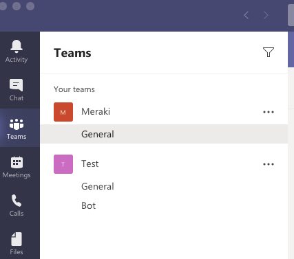

Click on Join or create a team at the bottom, choose From scratch and it can be either Public, Org-wide or Private. Once your team is created, click on Apps at the bottom left, and search for Incoming Webhook, and add the Webhook to your previously created team.

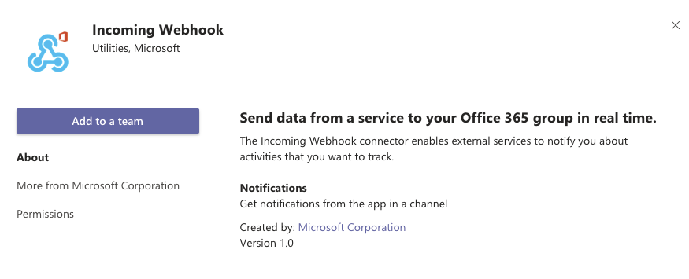

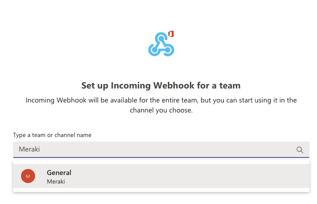

Click on Set up a Connector, and give your Webhook a Name, and optionally upload an image to it.

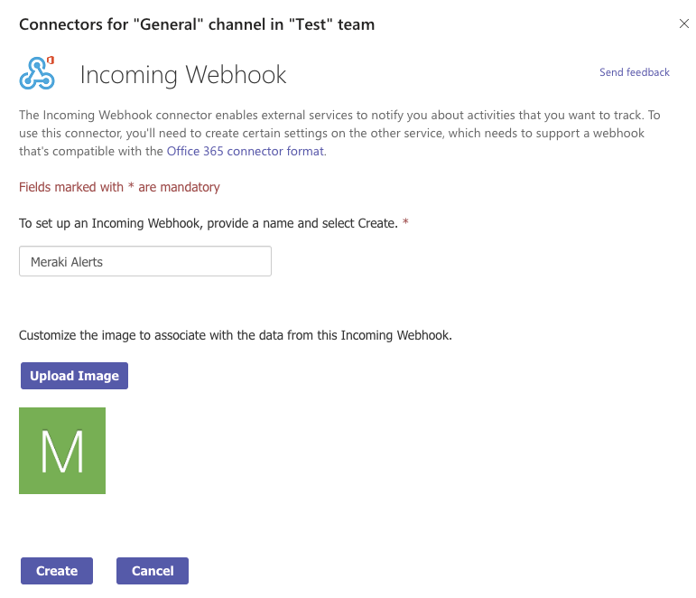

Click on Create and then take note of the Webhook URL for use later.

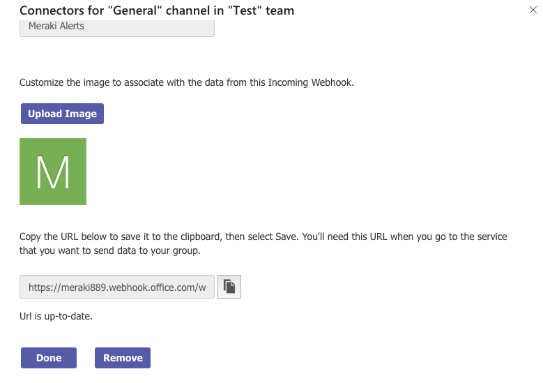

### Setting up your AWS Environment - Automated

The setup of your AWS environment can be performed in automated fashion using CloudFormation. The current template only supports being deployed in the US-West-1, US-West-2, US-East-1 and US-East-2 regions.

Simply download the cloudformation-mv-mt.yaml file [from the repository](https://github.com/Francisco-1088/meraki-mv-mt-aws) and log into your AWS account (or create a new [AWS Free account](https://aws.amazon.com/free/?all-free-tier.sort-by=item.additionalFields.SortRank&all-free-tier.sort-order=asc&awsf.Free%20Tier%20Types=*all&awsf.Free%20Tier%20Categories=*all)):

1. Type CloudFormation in the search box
2. In the top right, click Create stack with new resources

3. Under Prerequisite select **Template is ready** and under Specify template select **Upload a template file**, and upload the cloudformation-mv-mt.yaml file, and click Next

4. Under specify stack details, fill out the form as in the example, using your environment’s parameters

5. Click Next twice, and scroll down to the bottom, tick the checkbox that says “I acknowledge that AWS CloudFormation might create IAM resources” and click Create Stack

Wait for a minute, and your stack should be created and you’re ready to move on to the Meraki Dashboard configuration.

### Setting up your AWS Environment - Manual

If you deployed your AWS environment via CloudFormation, you can skip this section and go directly to the Meraki Dashboard configuration.

Download the Lambda deployment package  from the Github Repo: [https://github.com/Francisco-1088/meraki-mv-mt-aws](https://github.com/Francisco-1088/meraki-mv-mt-aws)

Log into your AWS account (or create a new [AWS Free account](https://aws.amazon.com/free/?all-free-tier.sort-by=item.additionalFields.SortRank&all-free-tier.sort-order=asc&awsf.Free%20Tier%20Types=*all&awsf.Free%20Tier%20Categories=*all)), and in the Console’s search bar look for AWS Lambda.

Select Create function, choose Author from scratch, give it a name, and select Python 3.7 as your runtime.

Scroll down to Code and on the right, select Upload from .zip file

Click Configuration, and select General configuration - Edit, assigning 256MB of memory, a timeout of 3 minutes and using the existing Role, and then Save.

Back in Configuration, select the Environment variables option, Edit, and fill out the following parameters:

*   MERAKI_BASEURL: Insert the API baseurl you’re using. Normally, [https://api.meraki.com/api/v1](https://api.meraki.com/api/v1)
*   MS_TEAMS_URL (OPTIONAL): Insert your MS Teams Webhook URL from the previous section
*   REGION_NAME: Enter the name of the AWS Region your working on (can check by clicking the option next to Support in your navigation bar, see picture below for reference)

Search for API Gateway in the search box and click on it.

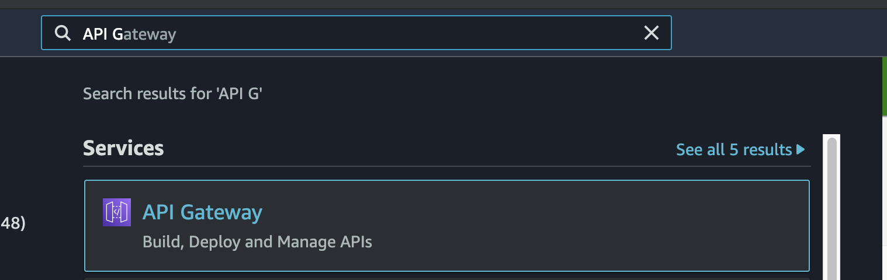

Click Create API and select REST API, clicking on Build.

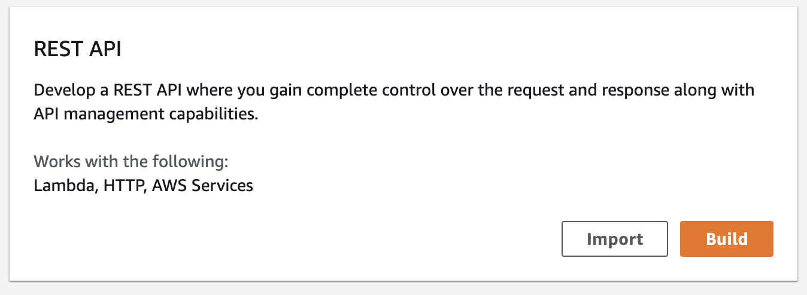

Give it a name and select Regional type Endpoint.

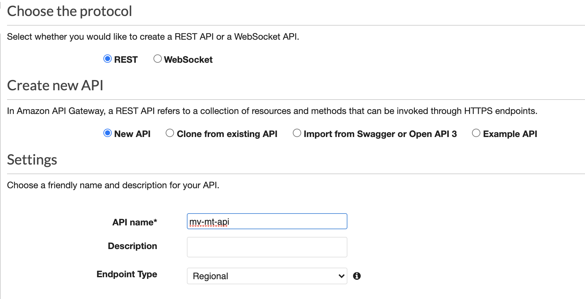

Click on Actions, Create Methods and select POST

Select Lambda Function as your integration type, and select your region and Lambda function from the list.

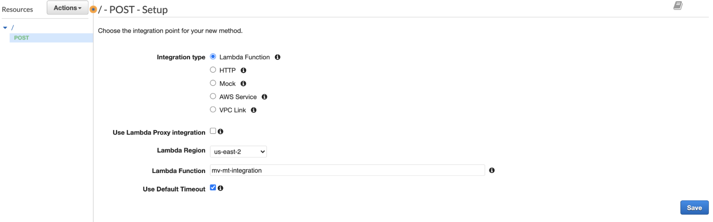

Again, click on Actions, select Deploy API, select New Stage and give it a name:

Go to Stages, select your newly created Stage and take note of the Invoke URL up top:

Go back to your Lambda function, and you should be seeing something like this:

In the search bar, type DynamoDB and select it:

Click Create table and give it a name, and specify a primary Key of alertId with the type string and click Create:

Go back to your Function, click Configuration and add a new Environment variable with the name of your DynamoDB table.

In the search box, type Secrets Manager:

Click Store a New Secret, select Other type of secrets and in the left box enter X-Cisco-Meraki-API-Key, and in the right box enter your Dashboard API Key

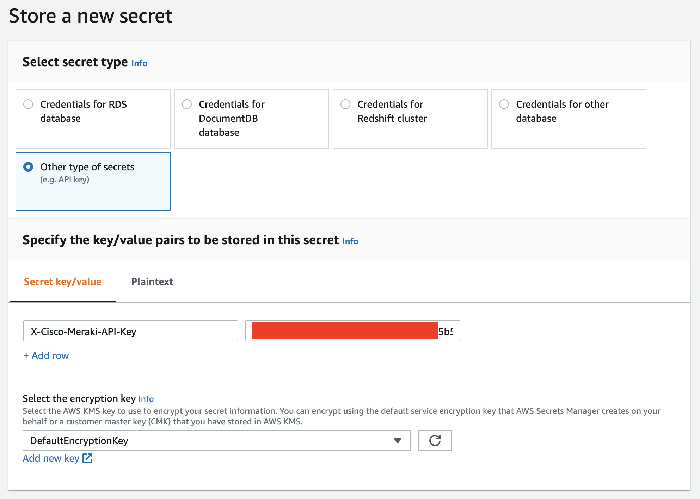

If you haven’t generated a Meraki Dashboard API Key, just log in to your Dashboard, click on your email address in the top right, select My Profile, scroll down and generate a new API Key, storing the value safely (for example in AWS Secrets Manager).

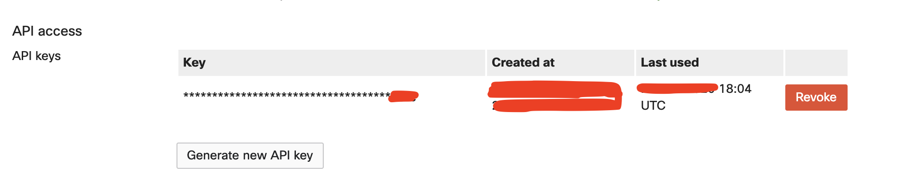

Give your secret the name X-Cisco-Meraki-API-Key, click Next, select Disable automatic rotation, click Next, review and then Store.

Repeat the previous steps, but now instead of calling it X-Cisco-Meraki-API-Key, call it Webex-Access-Token, and store the value of the Access token you generated in the previous section.

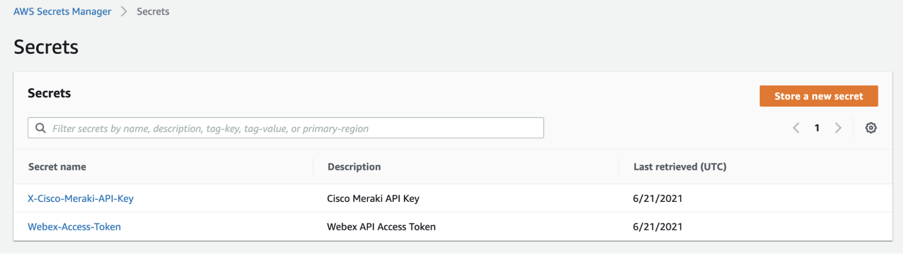

Now, it’s time to give your Lambda Function some permissions. You will first need to obtain the ARN (Amazon Resource Names) for your DynamoDB table, and your two Secrets. To do this go to DynamoDB, select your Table and then scroll all the way down and copy the Amazon Resource Name:

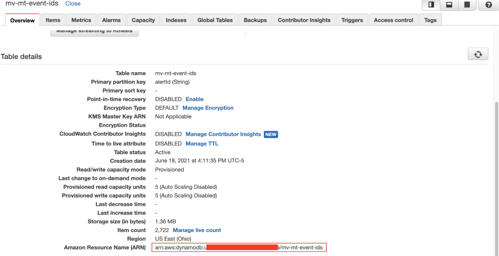

For your secrets, go to Secrets Manager, and click on each of them, and copy the Secret ARN for each of them.

Go back to your function, Click Configuration and then Permissions.

Click on your Execution Role name at the top.

Under permissions, click Add inline policy, we will create permissions for 5 actions your function must perform:

1. Allow Lambda to get your Meraki API Key from Secrets Manager
2. Allow Lambda to get your Webex Access Token from Secrets Manager
3. Allow Lambda to read items in your DynamoDB table
4. Allow Lambda to create items in your DynamoDB table
5. Allow Lambda to update items in your DynamoDB table

For the Secrets:

1. Select Add inline policy
2. Select Secrets Manager under service
3. Select Read Actions, and pick GetSecretValue
4. Under Resources, select specific and add each of the two ARNs for your Secrets
5. Review policy and create

For the DynamoDB permissions:

1. Select Add inline policy
2. Select DynamoDB under service
3. Pick GetItem from Read, and UpdateItem and PutItem from Write
4. Under Resources, select specific and add the ARN for your Table
5. Review policy and create

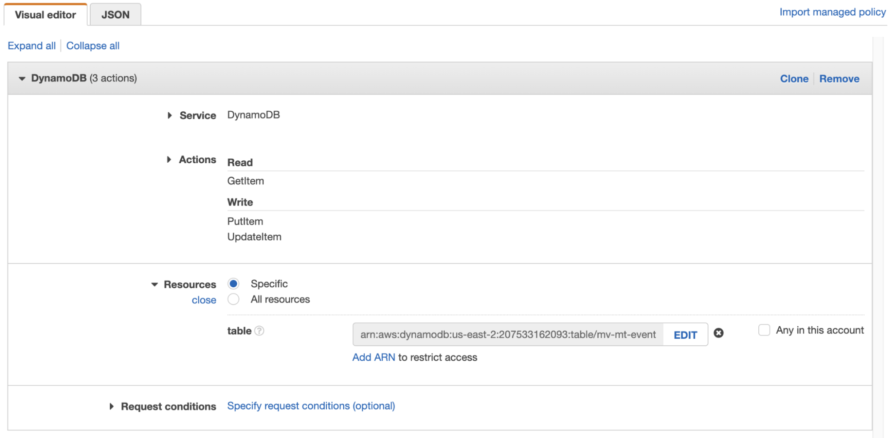

Go back to your Function Code, and make sure all changes have been Deployed by clicking Deploy.

Meraki Dashboard Configuration

Tag your MTs and MVs in pairs, with the MT having a tag of the format **mv-SERIAL**, where SERIAL is its paired MV camera’s serial, and the MV having a tag of the format **mt-SERIAL**, where SERIAL is its paired MT sensor’s serial. See the example below.

**_Paired MV and MT, where they each reference each other’s serial number in the tag._**

You may also add a tag of **delay-SECONDS** to your MT20 sensor. This tag delays the timestamp used for retrieval of the snapshot from the associated camera by the amount of seconds specified. For example, delay-3, retrieves a snapshot 3 seconds later from the actual opening of the MT20 sensor. This allows for some degree of fine tuning, as fetching the snapshot immediately after the door opens, can result in not capturing the exact moment when the person opening the door is visible.

You can modify this tag even while your receiver is already running.

**_Here the delay-3 tag will make the script fetch snapshots 3 seconds after the door open events._**

Apply a Door Open alert profile to your MT20s and add your Webhook created in the previous section to it. Optionally, if you only want to receive alerts if the door is open for a set amount of time, check the box “Alert only when open for more than…” and choose your preferred amount of time.

If you haven’t, generate an API Key under My Profile, and ask a Meraki SE or NSE to enable MT APIs in your organization.

## Webex and MS Teams Alerts with Motion Recap images

NOTE: For this section to work, ask your Meraki SE to enable MT APIs in your network.

It’s also possible to receive composite images in your alerts if you’ve set up the Motion Recap functionality as in part I. This part of the code will wait to receive a Motion detected alert, and then the code proceeds to verify the status of the door sensor associated with the camera that sent the alert (via the Tags you set before). If the door status is open, then the Image URL will be downloaded, and a new image will be crafted like the ones below.

Make sure you have tagged your cameras and sensors as described in the previous section. Then, for every camera that you want motion recap events for, enable Motion alerts with the schedule and sensitivity of your preference. Make sure to enable the Motion Recap image within the alert option, and to avoid noisiness define an Area of Interest around the door you’re monitoring.

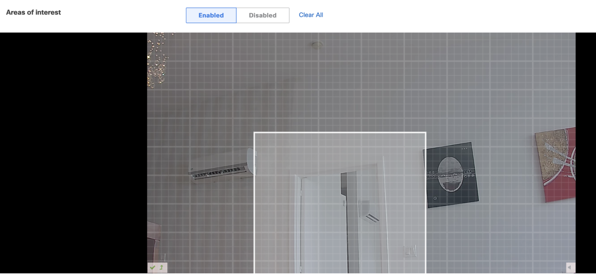

After this, go into your Network alerts, and add your Webhooks receiver as a custom recipient for Camera motion alerts.

The event workflow is as follows:

1. A person opens a door
2. The camera near the door triggers a motion alert which is sent to the Meraki cloud
3. The Meraki cloud sends a Webhook to a an Amazon API Gateway
4. Amazon API Gateway sends the event to AWS Lambda for processing
5. AWS Lambda queries DynamoDB for the Alert ID, and then discards any duplicate alerts, and processes new ones generating a new entry in DynamoDB
6. The Lambda application retrieves the Meraki Dashboard API Key and Webex Access Token securely from AWS Secrets Manager
7. AWS Lambda requests the state of the sensor specified in the camera tag in the received alert
8. The Meraki Dashboard requests the state of the specified sensor
9. The sensor responds to the Meraki cloud
10. The Meraki cloud sends the response to AWS Lambda
11. If the sensor state is open, AWS Lambda sends a Motion Recap adaptive card from the retrieved Sensor and motion recap image to Webex and/or MS Teams
12. AWS Lambda updates the alert entry in DynamoDB with metadata including
    1. Alert ID
    2. Alert Type (Sensor change or motion event)
    3. Network Name
    4. Camera Name
    5. Camera Link
    6. Snapshot Link
    7. Video Link
    8. Timestamp

The notification will contain:

*   Network Name
*   Camera Name and Model
*   Timestamp of event
*   A link to the video feed at the specified timestamp
*   A link to the associated sensor

## Appendix: Adaptive Cards for Webex and MS Teams

In the previous sections, for Webex and MS Teams you’ve been sending messages to these clients using a specialized format which is called Adaptive Card. This is a specification created by Microsoft, but which is compatible across several messaging platforms. This allows the creation of interactive messages and very visually appealing notifications. You may have seen them before in the Meraki Demo API Platform.

If you want to customize your cards to say something different or display different images, you may do so tweaking the adaptive_cards.py file, where a function has been created for each type of Adaptive Card (Door Open, Snapshot, Door Open for too Long and Motion Recap).

If you want to experiment with creating your own adaptive cards from scratch, you may use the following tools as guidance:

*   [Buttons and Cards](https://developer.webex.com/docs/api/guides/cards)
*   [Buttons and Cards Designer](https://developer.webex.com/buttons-and-cards-designer)

## Appendix: Reporting with DynamoDB and Cloudwatch

You can find all of the Motion and Open door events stored in your DynamoDB table and report on them. Go to DynamoDB and select your Table.

Click on the Items menu, and add filters with the attribute names of alertId, alertType, cameraLink, cameraName, isoTs, networkName, snapshotLink and videoLink, for example:

For troubleshooting your function, you can go to Lambda, choose your function, click Monitor and then in the Logs section you’ll see all of your function invocations. If you click on any of the LogStreams, you can look at the execution of the function

It’s also useful if you record successful invocation events by clicking on the event and copying all of it

You can then go back to your Function code, click on the down arrow next to Test and configure new Test events:

Paste your event into the box, and make sure to find and replace all instances of single quotes with double quotes to make it a valid JSON object.

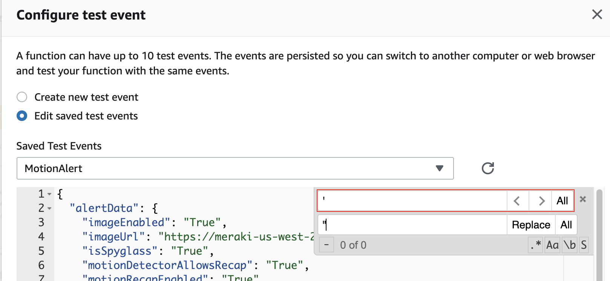

Also, make sure to convert any **True** values to **“True”**, again to convert it to a valid JSON document. Once it checks out, save it and you can use these test events in the future for any changes you implement in your code. Just make sure to vary the alertId by changing one or two numbers, otherwise you will get the duplicate alert message.

